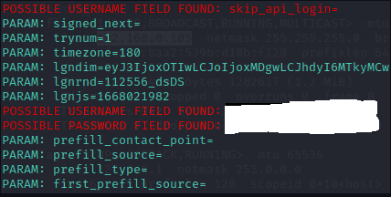

# Phishing to capture passwords from Facebook

### Tools

- Kali Linux
- setoolkit

### Configuring Phishing on Kali Linux

- Root access: ``` sudo su ```
- Initializing setoolkit: ``` setoolkit ```
- Attack type: ``` Social-Engineering Attacks ```
- Attack vector: ``` Web Site Attack Vectors ```
- Attack method: ```Credential Harvester Attack Method ```
- Attack method: ``` Site Cloner ```
- Getting machine IP: ``` ifconfig ```
- URL for clone: http://www.facebook.com

### Results 


